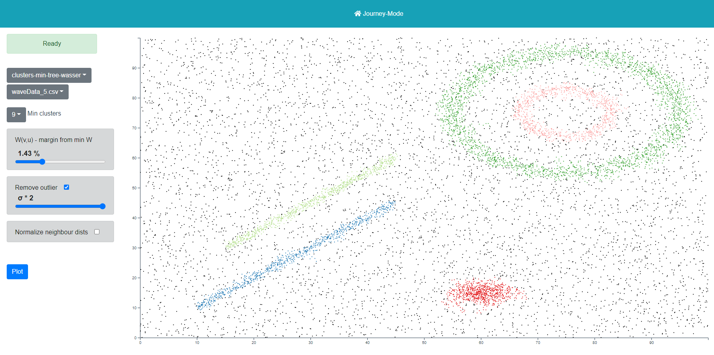

# clusterization-service


Get started with jupyter by going to https://jupyter.org/install.

When the notebook is opening in your browser - Success!

Now pick up a specific notebook from the resources folder and download the data from
https://github.com/JHL-HUST/AdaWaveClustering/tree/master/AdaWave/syntheticData

Make sure to update the paths in the python code to fit your environment.


# Steps to start the service locally
Open Power shell in your root directory

Set up your controller or app file for flask 
```
$env:FLASK_APP = "./sample/app.py"
```

At last
```
flask run
```
This will start up the app under http://localhost:5000

# Maintaining your env
Start virtual environment
```
venv\Scripts\activate
```
Then you can install the packages you need in your environment


# Current supported api

### Configuration endpoints
```
/api/v1/version

/api/v1/files

/api/v1/views
```

### File viewer endpoints to execute a specific algorithm for different views of data from files
```
/api/v1/views/clusters/files/<filename>

/api/v1/views/simple-plots/files/<filename>

/api/v1/views/delaunay-triangulation/files/<filename>

/api/v1/views/minimum-spanning-tree/files/<filename>

/api/v1/views/minimum-spanning-tree-wasser/files/<filename>
```


### File viewer endpoints to execute a specific algorithm for clustering of file data
```
/api/v1/views/clusters/files/<filename>

/api/v1/views/clusters-min-tree-wasser/files/<filename>
```


### File viewer endpoints to plot variances
```
/api/v1/views/variances-plots/files/<filename>
```


### File viewer endpoints to plot via matplot lib
```
/api/v1/plots/files/<filename>

/api/v1/plots/clusters/files/<filename>
```

Example: http://localhost:5000/api/v1/version